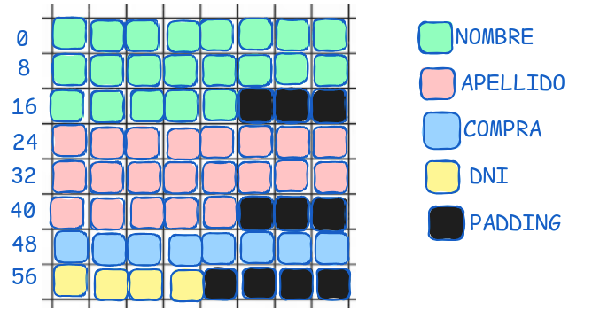
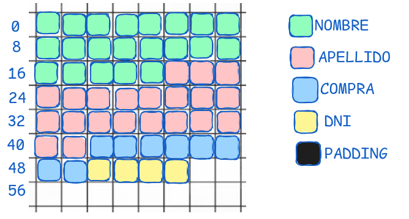

Teniendo en cuenta las siguientes estructuras en C:
```c
#define NAME_LEN 21
typedef struct cliente_str {
    char nombre[NAME_LEN];
    char apellido[NAME_LEN];
    uint64_t compra;
    uint32_t dni;
} cliente_t;
```
* `nombre` y `apellido` son cadenas de caracteres de tamaño fijo, 21 bytes. 

* `compra` es un entero sin signo de 8 bytes.

* `dni` es un entero sin signo de 4 bytes.

```c
typedef struct __attribute__((__packed__)) packed_cliente_str {
    char nombre[NAME_LEN];
    char apellido[NAME_LEN];
    uint64_t compra;
    uint32_t dni;
} __attribute__((packed)) packed_cliente_t;
```
## a) Dibuje un diagrama de organización en memoria de las estructuras `cliente_t` y `packed_cliente_t` marcando el espacio usado para alineación y padding.

Los datos se van a organizar en la memoria dependiendo de si se usa o no el atributo `packed`. Si se usa, los datos se van a organizar de manera contigua, sin padding. Si no se usa, los datos se van a organizar de manera alineada, con padding, alineandose así al tamaño del tipo de dato más grande de la estructura.

<u>Sin el atributo `packed`:</u>



<u>Con el atributo `packed`:</u>



---

## b) Escriba un programa en Assembler que dado un arreglo `cliente_t[]` con su longitud devuelva un puntero a alguno uno de sus elementos al azar.

Tip Para la generación de números aleatorios puede utilizar la función `rand` provista por la biblioteca estándar de C.

El puntero al array de clientes se pasa por el registro `rdi` y la longitud del array se pasa por el registro `rsi`. Se utiliza la función `rand` para generar un número aleatorio entre 0 y la longitud del array. Luego se multiplica por el tamaño de la estructura `cliente_t` para obtener el offset del elemento en el array. Finalmente se suma el offset al puntero al array y se devuelve.

```asm
section .data
    client_t_size equ 64
section .text
    global random_client
    random_client:
        push rbp
        mov rbp, rsp
        mov rax, 0
        jmp .call_rand

        .continue:
            cmp rax, rsi
            jge .call_rand
            mov rdx, client_t_size
            imul rdx
            pop rbp
            ret
        
        .call_rand:
            push rdi
            push rsi
            call rand
            pop rdi
            pop rsi
            jmp .continue

```
