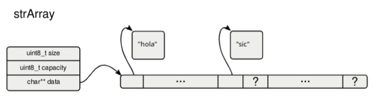

Implementa un $\textcolor{pink}{array\ dinámico}$ de capacidad limitada. 

El mismo puede contener como máximo la cantidad de strings indicada en $\textcolor{pink}{capacity}$. 

Los datos serán todos del tipo `String`

La estructura `str_array_t` contiene un puntero al $\textcolor{pink}{arreglo}$ identificado como $\textcolor{pink}{data}$ y la cantidad de elementos ocupados como $\textcolor{pink}{size}$.



```c
typedef struct str_array {
    uint8_t size;
    uint8_t capacity;
    char** data;
} str_array_t;
```
Implementar las siguientes funciones en asm:
```c
str_array_t* strArrayNew(uint8_t capacity){
    str_array_t* a = malloc(sizeof(str_array_t));
    a->size = 0;
    a->capacity = capacity;
    a->data = malloc(sizeof(char*) * capacity);
    return a;
}
```
Crea un array de strings nuevo con capacidad indicada por $\textcolor{pink}{capacity}$.
```asm
STR_ARRAY_SIZE EQU 16
OFFSET_SIZE EQU 0
OFFSET_CAPACITY EQU 1
OFFSET_DATA EQU 8
SIZE_OF_CHAR_PTR EQU 8
;dil = capacity
strArrayNew:
    push rbp
    mov rbp, rsp
    push r12
    push r13
    xor r12, r12
    mov r12b, dil           ; r12b = capacity
    mov rdi, STR_ARRAY_SIZE
    call malloc
    ; rax = struct str_array_t
    mov r13, rax            ; r13 = struct str_array_t
    mov byte [r13 + OFFSET_SIZE], 0
    mov byte [r13 + OFFSET_CAPACITY], r12b
    xor rdi, rdi
    xor rax, rax
    mov rax, SIZE_OF_CHAR_PTR
    mul r12
    mov rdi, rax    ; rdi = sizeof(char*) * capacity
    call malloc
                    ; rax = char** data
    mov [r13 + OFFSET_DATA], rax
    mov rax, r13
    pop r13
    pop r12
    pop rbp
    ret
```
```c
uint8_t strArrayGetSize(str_array_t* a)
```
Obtiene la cantidad de elementos ocupados del arreglo.
```c
char* strArrayGet(str_array_t* a, uint8_t i)
```
Obtiene el i-ésimo elemento del arreglo, si i se encuentra fuera de rango, retorna NULL.
```c
char* strArrayRemove(str_array_t* a, uint8_t i)
```
Quita el i-ésimo elemento del arreglo, si i se encuentra fuera de rango, retorna NULL. El arreglo es reacomodado de forma que ese elemento indicado sea quitado y retornado.
```c
void strArrayDelete(str_array_t* a)
```
Borra el arreglo, para esto borra todos los strings que el arreglo contenga, junto con las estructuras propias del tipo
arreglo