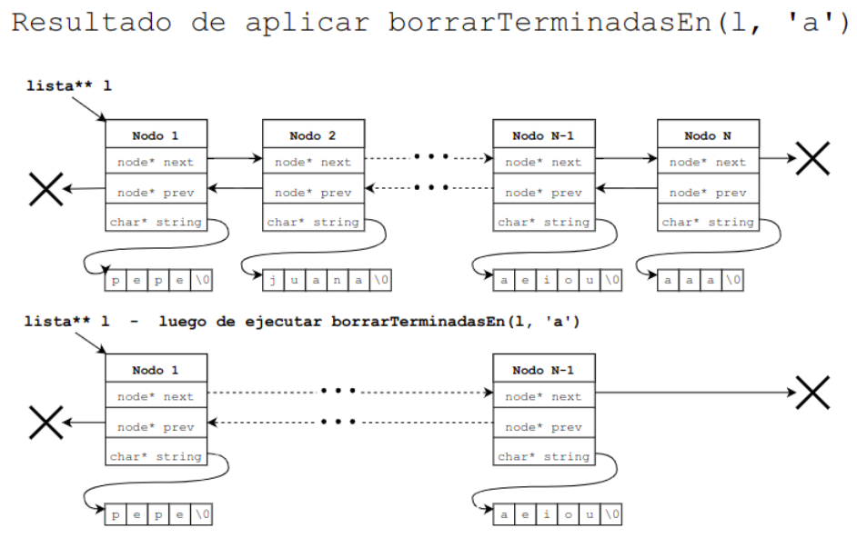

Considerar una estructura de $\textcolor{pink}{lista\ doblemente\ enlazada}$ en donde cada $nodo$ almacena un $string$ de $C$, es decir, un arreglo de caracteres finalizado en el caracter nulo (`‘\0’`).
```c
typedef struct node_t {
    struct node_t *next;
    struct node_t *prev;
    char *string;
} node;
```
a. Escribir en `ASM` una función que reciba como parámetros `n`: `doble puntero a nodo` y lo borre de la lista junto a su `string`. 

Esta función se puede usar tanto para borrar el primer elemento de la lista `(borrarNodo(&lista);)` como para
borrar algún otro `(borrarNodo(&lista->next->next);)`, suponiendo que se pasa un puntero al campo `next` del nodo
anterior.

Utilizar la función `free` para borrar tanto los nodos como las strings.

```c
void borrarNodo(node** n){
    node* aux = *n;
    if(aux->prev != NULL){
        aux->prev->next = aux->next;
    }
    if(aux->next != NULL){
        aux->next->prev = aux->prev;
    }
    free(aux->string);
    free(aux);
}
```
```asm
NULL EQU 0
NEXT_OFFSET EQU 0
PREV_OFFSET EQU 8
STRING_OFFSET EQU 16
;rdi = doble puntero a nodo
borrarNodo:
    push rbp
    mov rbp, rsp
    mov rdi, [rdi]    ;rdi = puntero a nodo
    mov rax, [rdi + NEXT_OFFSET]    ;rax = aux->next
    cmp rax, NULL
    jne .enganchar_next

    ;aux->prev->next = aux->next;
    .enganchar_next:
        mov r8, [rdi + PREV_OFFSET]    ;r8 = aux->prev
        mov r9, [r8 + NEXT_OFFSET]    ;r9 = aux->prev->next
        mov r10, [rdi + NEXT_OFFSET]    
        mov [r9], r10

    mov rax, [rdi + PREV_OFFSET]    ;rax = aux->prev
    cmp rax, NULL
    jne .enganchar_prev

    ;aux->next->prev = aux->prev;
    .enganchar_prev:
        mov r8, [rdi + NEXT_OFFSET]    ;r8 = aux->next
        mov r9, [r8 + PREV_OFFSET]    ;r9 = aux->next->prev
        mov r9, [rdi + PREV_OFFSET]    
        mov r10, [rdi + PREV_OFFSET]    ;r10 = aux->prev;
        mov [r9], r10

    push rdi
    sub rsp, 8
    mov rdi, [rdi + STRING_OFFSET]    ;rdi = aux->string
    call free
    add rsp, 8
    pop rdi
    call free

    pop rbp
    ret
```

b. Escribir en ASM una función que reciba como parámetros `l`: `doble puntero a nodo` y `c`: un `caracter`, y borre todos los nodos, junto con la string, para los nodos donde el  ́ultimo caracter del string sea c.

Utilizar la función del item anterior para borrar los nodos.

Su aridad es: `void borrarTerminadasEn(node** l, char c)`.

En el caso de borrar el primer elemento de la lista se debe actualizar el puntero recibido



```c
void borrarTerminadasEn(node** l, char c){
    node* aux = *l;
    while(aux != NULL){
        if(aux->string[strlen(aux->string) - 1] == c){
            borrarNodo(&aux);
        }
        aux = aux->next;
    }
}
```

```asm

```

c. Escribir en ASM la función `char* superConcatenar(node* n)`, que toma `un puntero a un nodo cabeza de lista` y retorna una `nueva cadena` que contiene la `concatenación` de todas las strings almacenadas en la lista.

Se cuenta con la función `uint32_t strlen(char* s)` que dada una `string`, retorna la cantidad de caracteres válidos de la misma.

```c
char* superConcatenar(node* n){
    node* aux = n;
    uint32_t len = 0;
    while(aux != NULL){
        len += strlen(aux->string);
        aux = aux->next;
    }
    char* res = malloc(len + 1);
    aux = n;
    uint32_t i = 0;
    while(aux != NULL){
        uint32_t j = 0;
        while(aux->string[j] != '\0'){
            res[i] = aux->string[j];
            i++;
            j++;
        }
        aux = aux->next;
    }
    res[i] = '\0';
    return res;
}
```
```asm
;rdi = puntero a nodo
NULL EQU 0
NEXT_OFFSET EQU 0
STRING_OFFSET EQU 16
superConcatenar:
    push rbp
    mov rbp, rsp
    push r12
    xor r12, r12    ;r12 = len uint32_t len = 0;
    push r13
    mov r13, rdi    ;r13 = aux node* aux = n;
    push r14
    mov r14, rdi    ;r14 = n
    sub rsp, 8

    .while_len:
        cmp r13, NULL       ;while(aux != NULL)
        mov rdi, r12
        inc rdi     
        call malloc     ;char* res = malloc(len + 1);
        mov rcx, r12
        mov rdx, rax    ;rdx = nuevo string
        je .while_concat
        mov rdi, [r13 + STRING_OFFSET]    ;rax = aux->string
        call strlen
        add r12, rax        ;len += strlen(aux->string);
        mov r13, [r13 + NEXT_OFFSET]    ;aux = aux->next;
        jmp .while_len

    .while_concat:
        cmp r14, NULL   ; while(aux != NULL)
        je .end
        cmp [r14 + STRING_OFFSET], NULL     ;while(aux->string[j] != '\0')
        je .incrementar_nodo
        mov rdx, [r14 + STRING_OFFSET]      ;res[i] = aux->string[j];
        inc rdx
        inc r14
        loop .while_concat

    .incrementar_nodo:
        mov r14, [r14 + NEXT_OFFSET]    ;aux = aux->next;
        jmp .while_concat

    .end:
        mov [rdx], NULL     ;res[i] = '\0';
        add rsp, 8
        pop r14
        pop r13
        pop r12
        pop rbp
        ret    
```
