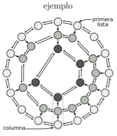
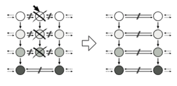
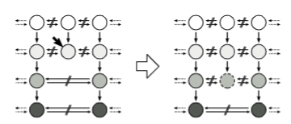

Sea la siguiente estructura de listas doblemente enlazadas $\textcolor{pink}{encadenadas}$ entre si.
```c
struct supernode {
    supernode* abajo;
    supernode* derecha;
    supernode* izquierda;
    int dato;
};
```
* todos los `nodos` pertenecen a una lista doblemente enlazada
* todos los `nodos` son referenciados desde algun otro nodo en otra lista (excepto en la primera)
* todas las `listas` respetan el orden de los nodos que las apuntan



Implementar en ASM las siguientes funciones.

a. `void borrar columna(supernode** sn)`: 

Dado un `doble puntero a nodo` dentro de la primera lista, borra una columna de nodos. 

Modifica el doble puntero dejando un nodo valido de la primer lista.



```c
void borrar_columna(supernode** sn){
    supernode* aux = *sn;
    supernode* aux_abajo = aux->abajo;
    while(aux_abajo != NULL){
        aux->derecha->izquierda = aux->izquierda;
        aux->izquierda->derecha = aux->derecha;
        free(aux);
        aux = aux_abajo;
        aux_abajo = aux_abajo->abajo;
    }
}
```

b. `void agregar abajo(supernode** sn, int d)` 

Agrega un nuevo nodo a la lista inmediata inferior del nodo apuntado. 

Considerar que el nodo donde agregar puede no tener vecinos inmediatos en la lista inferior.



