### Ejercicio 1 - (70 puntos)

En un sistema similar al que implementamos en los talleres del curso (modo protegido con
paginación activada) se pide:

$a.$ Implementar la Syscall `exit` que al ser llamada por una tarea, inactiva dicha tarea y pone a correr la siguiente (según indique el sistema de prioridad utilizado).

Mostrar el código.

### isr.asm

```asm
global _isr99
; Syscall exit
_isr99:
    pushad
    call sched_exit_task
    
    ; Igual que en RAI de reloj
    mov word [sched_task_selector], ax
    jmp far [sched_task_offset]
    
    .fin:
    ; Actualizamos las estructuras
    compartidas ante el tick del reloj
    call tasks_tick
    
    ; Actualizamos la "interfaz" del
    sistema en pantalla
    call tasks_screen_update
    
    popad
    iret
```

### sched.c

```c
uint16_t sched_exit_task(void) {
    // apagamos a la tarea
    sched_disable_task(current_task);

    // buscamos la siguiente tarea activa de acuerdo a la politica de scheduling y devolvemos la nueva tarea
    return sched_next_task();
}
```

$b.$ ¿Cómo modificarías el punto anterior para que `exit` (además de lo que hace normalmente) guarde el `ID` de quién la llamó en el `EAX` de próxima tarea a ejecutar?

Mostrar código.

Pasos de la resolución:

1. Obtener el id de la tarea que llama a la syscall
2. Desactivar la tarea actual
3. Buscar la siguiente tarea a ejecutar
    * Obtener el id
    * Obtener el selector
4. Antes de realizar el cambio de contexto, escribir el id obtenido en el paso 1 en el EAX destino.

    Para eso:
    * Obtenemos la TSS de la nueva tarea
    * Buscamos el ESP de la nueva tarea
    * Nos movemos en la pila hasta donde se ubica el EAX (pusheado por pushad antes de
cambiar de contexto)
d. Lo pisamos con el id
5. Seguimos con el cambio de contexto normal

Consideraciones:

* Se asume que la nueva tarea fue desalojada por el reloj al menos una vez.
* Si no fuera así, el eax de la tss va a ser el de nivel de usuario y deberíamos pisar ese directamente
* Va a ser necesario modificar la RAI de reloj para que reciba por parámetro el id de la nueva tarea. queda para el punto C.

### isr.asm

```asm
extern current_task
…
_isr99:
    pushad

    ; paso 1
    push DWORD [current_task]

    ; paso 2
    call sched_disable_task

    ; paso 3.a
    call sched_next_task_id

    ; ahora tenemos en eax el id de la nueva tarea en eax
    push eax
    ...
```

1. Obtener el id de la tarea que llama a la syscall
2. Desactivar la tarea actual
3. Buscar la siguiente tarea a ejecutar
    * Obtener el id
    * Obtener el selector 

```asm
    ; tenemos en eax el id de la nueva tarea en eax
    
    ; paso 4
    call pass_exit_id_to_next_task
    
    ; paso 3.b
    call sched_next_task
    
    ; paso 5, sigue igual que antes
    ; Igual que en RAI de reloj
    mov word [sched_task_selector], ax
    jmp far [sched_task_offset]

    ;terminamos la interrupción
    ...
```

3. Buscar la siguiente tarea a ejecutar
    * Obtener el id
    * Obtener el selector

4. Escribir el id obtenido en el paso 1 en el
EAX destino
    * Obtenemos TSS de la nueva tarea
    * Buscamos el ESP de la nueva tarea
    * Buscamos EAX en pila (por pushad)
    * Lo pisamos con el id

5. Seguimos con el cambio de contexto
normal

```asm
.fin:
    mov esp, 8
    
    ; Actualizamos las estructuras compartidas ante
    el tick del reloj
    call tasks_tick
    
    ; Actualizamos la "interfaz" del sistema en
    pantalla
    call tasks_screen_update
    
    popad
    iret
```

5. Seguimos con el cambio de contexto normal

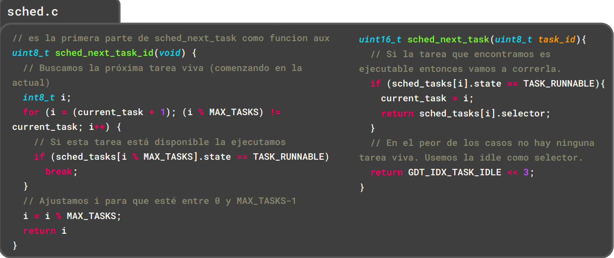

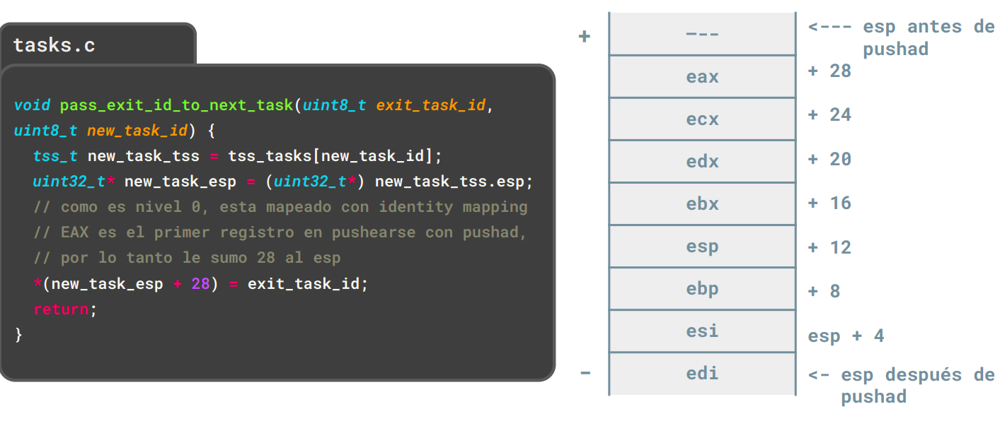

$c.$ ¿Y si ahora no es la Syscall `exit` la que modifica el `EAX` de nivel 3 de la tarea que va a ser ejecutada luego de la llamada a la Syscall sino la interrupción de reloj?

Como deberías modificar el código de la interrupción de reloj?.

Mostrar el código y explicar todo lo que agregues al sistema.

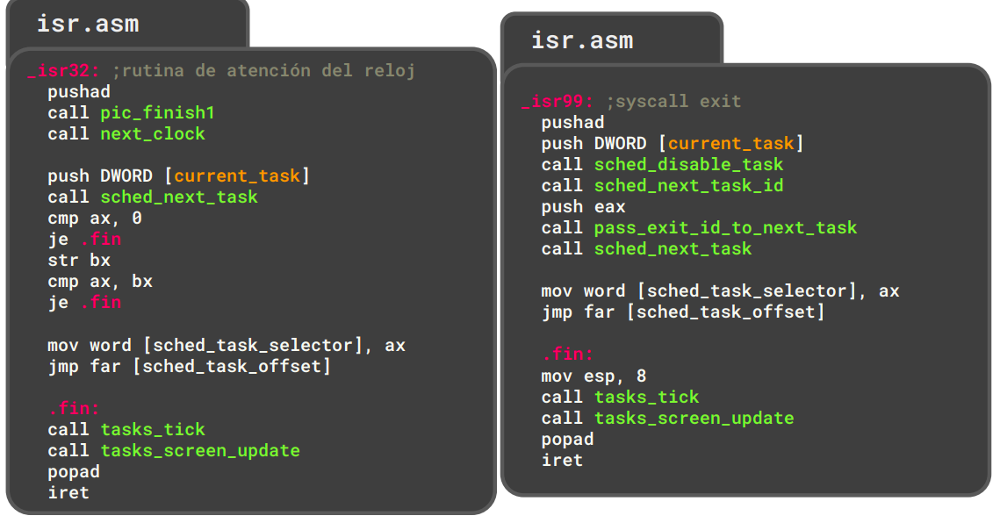

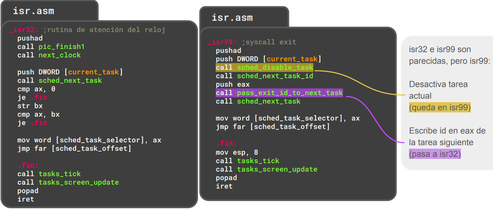

$d.$ ¿Considerás que es una buena práctica que las tareas se comuniquen sobreescribiendo los registros de propósito general de otra tarea?

¿Qué problemas pueden surgir?

Teniendo en cuenta lo visto en la materia, ¿de que otra forma se podrían pasar mensajes las tareas entre sí? 

Hacer un esquema que muestre los mapeos de memoria virtual a física de dos tareas que usen la
forma de comunicarse propuesta por ustedes.

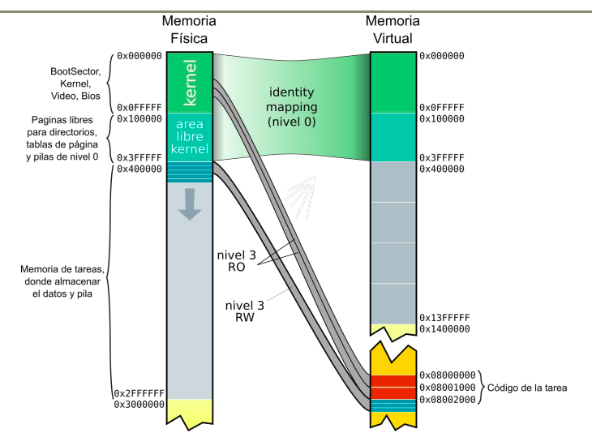

Realizá un diagrama que muestre la interacción del mecanismo con el scheduler y/o los mapeos de memoria.

Se recomienda organizar la resolución del ejercicio realizando paso a paso los items mencionados
anteriormente y explicar las decisiones que toman.


### Ejercicio 2 - (30 puntos)

El `ENTEL575` fué un microprocesador compatible con los Intel i686.

Este procesador incluía varias funcionalidades extra que nunca fueron replicadas por Intel.

Una de ellas es la operación `RSTLOOP`, la cual escribe un cero en ECX ’reiniciando’ el contador de vueltas.

`RSTLOOP` se codifica con la secuencia de bytes `0x0F` `0x0B`.

Tenemos un montón de software escrito para el `ENTEL575` pero lamentablemente no poseemos hardware que lo pueda correr. 

¿Podrías desarrollar un sistema que nos permita hacerlo?

Para ello respondé los siguientes puntos:

$a.$ ¿Qué excepción ocurre cuándo un procesador x86 intenta ejecutar una instrucción no soportada?

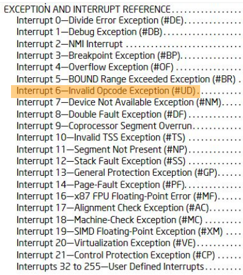

$b.$ Realice un diagrama de pila que muestre el estado de la pila del kernel luego de que una aplicación de usuario intentó ejecutar `RSTLOOP`.

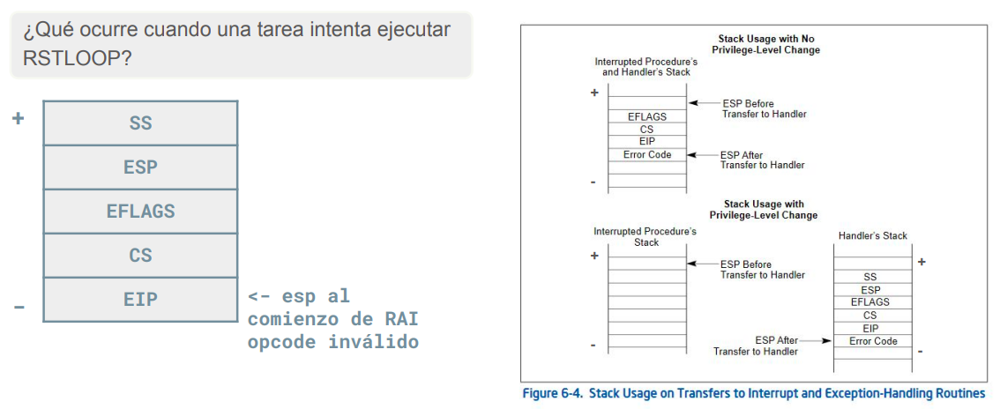

$c.$ ¿Qué dirección de retorno se encuentra en la pila al atender la excepción?

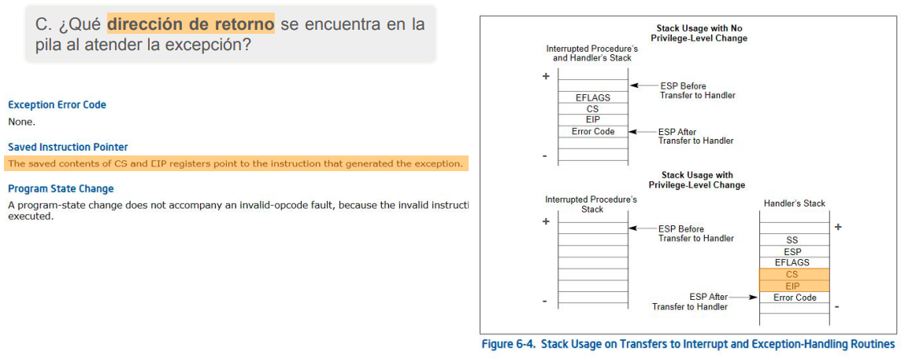

$d.$ Describa una posible implementación de `RSTLOOP` utilizando el mecanismo descrito en $(a)$ y $(b)$.

- El mecanismo propuesto sólo debe actuar cuándo la instrucción no soportada es RSTLOOP.
- Si la instrucción que generó la excepción no es RSTLOOP la tarea debe ser deshabilitada y la ejecución debe saltar a la tarea idle.
- Si la instrucción que generó la excepción es RSTLOOP adecúe la dirección de retorno de manera que permita a la tarea continuar la ejecución sin problemas.

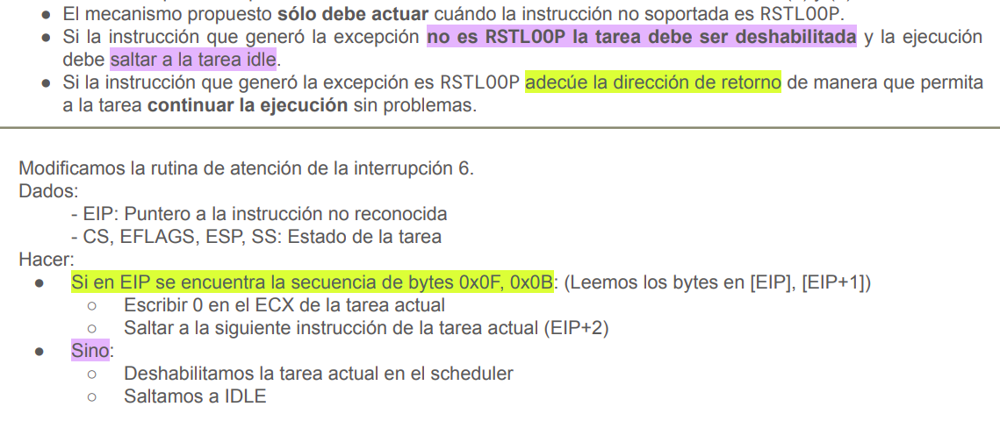

$e.$ ¿Qué ocurriría si no se adecuara la dirección de retorno luego de simular RSTLOOP?

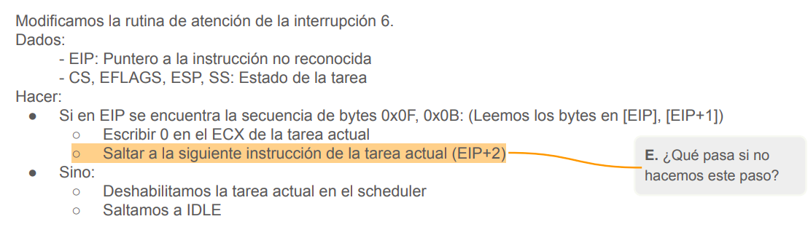

$f.$ Detalle los cambios a las estructuras del sistema visto en el taller que haría para realizar la implementación descrita en $(d)$.

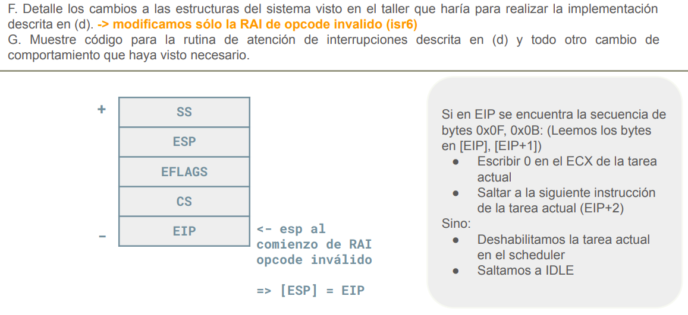

$g.$ Muestre código para la rutina de atención de interrupciones descrita en $(d)$ y todo otro cambio
de comportamiento que haya visto necesario.

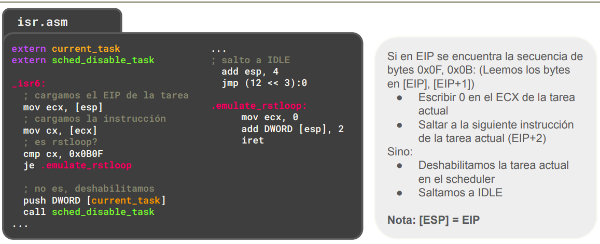

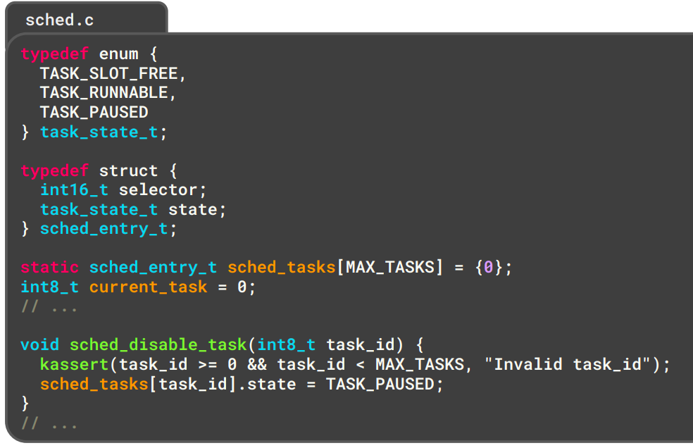

Recomendaciones:

- Lea el capítulo del manual sobre interrupciones y excepciones
- Revise con sumo cuidado el Exception and interrupt reference
- Repase el mecanismo de cambio de pila
- Recuerde los mecanismos que el procesador le ofrece para realizar cambios de tareas
