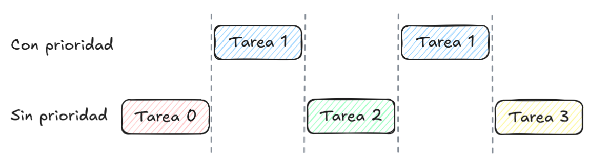

## Ejercicio 1 - (50 puntos)

En un sistema similar al que implementamos en los talleres del curso (modo protegido con paginación activada), se tienen varias tareas en ejecución. 

Se desea agregar al sistema una syscall que le permita a la tarea que la llama **espiar** la memoria de las otras tareas en ejecución.

En particular queremos copiar `4 bytes` de una dirección de la tarea a espiar en una dirección de la tarea llamadora (tarea
espía). 

La syscall tendrá los siguientes parámetros:
* El `selector` de la tarea a espiar.
* La `dirección virtual` a *leer* de la tarea espiada.
* La `dirección virtual` a *escribir* de la tarea espía.

Si la dirección a espiar no está *mapeada* en el espacio de direcciones de la tarea correspondiente, la **syscall** deberá devolver $−1$ en eax, por el contrario, si se pudo hacer correctamente la operación
deberá devolver $0$ en eax.

Se pide:

$a.$ Definir o modificar las estructuras de sistema necesarias para que dicho servicio pueda ser invocado.

### Syscalls (repaso)
* Son interrupciones llamadas por el usuario (nivel 3)
* Le permiten a las tareas hacer cosas que no pueden hacer porque no tienen privilegios de nivel 0
* Por ejemplo cambiar la paginación (como en este caso)
* Usamos `IDTENTRY3`, y declaramos (por ejemplo) `IDTENTRY3(99);`

```c
#define IDT_ENTRY3(numero)               
  idt[numero] = (idt_entry_t) { 
    .offset_31_16 = HIGH_16_BITS(&_isr##numero),                            .offset_15_0 = LOW_16_BITS(&_isr##numero),                            .segsel = GDT_CODE_0_SEL,                           .type = INTERRUPT_GATE_TYPE,                      .dpl = 3,                                        .present = 1                                                               
}
```

### Agregar una nueva Syscall
* Para esto tenemos que hacer una entrada de la `IDT` (mayor a 32 ya que están reservados, y distinto a los que usamos, en general, entre 0x80 y 0xFF)
* Modificamos  para agregar su rutina de interrupción
* Pasamos los parametros del modo que nos parezca, ya que para las syscall no
hay una convención (en general designamos algunos registros)
* Designo para llamar a la syscall los parámetros en
    * Selector: `AX`
    * Dirección virtual a leer de la tarea espiada: `EDI`
    * Dirección virtual a escribir de la tarea espía: `ESI`

$b.$ Implementar la syscall y especificar claramente la forma de pasarle los parámetros correspondientes.

Se recomienda organizar la resolución del ejercicio realizando paso a paso los items mencionados anteriormente y explicar las decisiones que toman.

Aclaraciones:
- Se puede asumir que el selector de tarea pasado es válido.
- Se puede asumir que la dirección de destino de la tarea llamadora se encuentra correctamente mapeada.

```asm
global _isr99
    
_isr99:
    pushad
    ;codigo
    mov [ESP + offset_EAX], EAX
    ;IMPORTANTE para no pisar el resultado con el popad
    
    popad
    iret
```
```asm    
; PushAD Order
%define offset_EAX 28
%define offset_ECX 24
%define offset_EDX 20
%define offset_EBX 16
%define offset_ESP 12
%define offset_EBP 8
%define offset_ESI 4
%define offset_EDI 0
```

### Espiando
#### ¿Que problemas nos encontramos para leer direcciones virtuales de otra tarea?

* El sistema de paginación es distinto
* >No tenemos acceso a esas páginas a menos que las mapeemos

#### ¿Que podemos hacer para mapear?

`Hint`:Los datos están en la posición de memoria física apuntada por la dirección virtual de la terea a espiar

* Esto significa que si conseguimos leer esa posición física vamos a poder leer los datos, pero no podemos acceder a las direcciones virtuales de manera directa ya que la paginación está activada.
* Vamos a mapear esa dirección física a una dirección virtual para copiarla

### Copiando la copia
* Tenemos que mapear una **dirección virtual cualquiera** a la dirección física que queremos acceder
* Tenemos que **leer información de esa dirección virtual**
* Al terminar de leer tenemos que **desmapear la dirección virtual utilizada para
acceder a esa dirección física**
* Esto es muy similar a... `Copy Page!`

### Pasos para copiar
1. Obtener la `dirección física` accediendo a las estructuras de paginación de la tarea espiada a traves de su `selector`
2. **Mapear la dirección física** a una dirección virtual que no esté en uso
3. Leer `4 bytes` de esa posición y guardarlos
4. **Desmapear** la página que mapeamos en el segundo paso

```
_isr99:
    pushad
    push ESI 
    push EDI
    push EAX
    call espiar
    
    ;acomodo la pila
    add ESP, 12
    ;IMPORTANTE para no pisar el resultado con el popad
    mov [ESP+offset_EAX], eax 
    
    popad
    iret
```

```c
int espiar(uint16_t selector, uint32_t* direccion_a_espiar, uint32_t* direccion_a_escribir){
    uint32_t cr3_tarea_a_espiar = obtenerCR3(selector);
    
    uint32_t cr3_tarea_espia = rcr3();  ∕∕Guardo el cr3 actual

    paddr_t direccion_fisica_a_espiar = obtenerDireccionFisica(cr3_tarea_a_espiar, direccion_a_espiar); 
    
    if (direccion_fisica_a_espiar == 0) return -1;   ∕∕ Falló si la dirección de memoria no era válida
    
    mmu_map_page(cr3_tarea_espia, SRC_VIRT_PAGE, direccion_fisica_a_espiar)
    ∕*Nota: Acá usé SRC_VIRT_PAGE definida en copy_page()
    Podría usar otra dirección virtual pero es importante usar una reservada 
    para no pisar un mapeo válido *∕
    
    ∕∕Como 4 bytes son 32 bits me alcanza con una variable
    uint32_t dato_a_copiar = *((SRC_VIRT_PAGE & 0xFFFFFF000) | VIRT_PAGE_OFFSET(direccion_a_espiar));
    ∕∕IMPORTANTE no olvidar el offset!
    
    mmu_unmap_page(cr3_tarea_espia, SRC_VIRT_PAGE, direccion_fisica_a_espiar);

    direccion_a_escribir[0] = dato_a_copiar;

    return 0;
}
```

```c
uint32_t obtenerCR3(selector){

}
```
La idea es:

1. Quedarnos con el `indice del selector`.
2. Obtener la base de la `gdt`.
3. Sumarle el `indice` multiplicado por el tamaño de la entrada (indexar en el índice a un puntero de structs si se hace en C).
4. Sumarle el `offset` del cr3 y retornar el valor apuntado. (Obtener el elemento cr3 del struct si se hace en C).

```c
uint32_t obtenerDireccionFisica(uint32_t cr3_tarea_a_espiar,uint32_t* direccion_a_espiar){
    
    ∕∕Nos inspiramos en las funciones de map_page y unmap_page
    pd_entry_t* pd = (pd_entry_t*)CR3_TO_PAGE_DIR(cr3_tarea_a_espiar);
    int pdi = VIRT_PAGE_DIR(direccion_a_espiar);

    if (!(pd[pdi].attrs & MMU_P)){  ∕∕Si no está mapeada (presente) devuelvo 0 
        return 0;
    } 
    
    pt_entry_t* pt = (pt_entry_t*)MMU_ENTRY_PADDR(pd[pdi].pt);
    int pti = VIRT_PAGE_TABLE(direccion_a_espiar);

    if (!(pt[pti].attrs & MMU_P)){ ∕∕Idem al anterior
        return 0;
    }

    paddr_t direccion_fisica = MMU_ENTRY_PADDR(pt[pti].page);

    ∕∕Hasta acá es CASI IGUAL a mmu_unmap_page (solo cambié nombres de variables), ahora en vez de poner el present en 0, solo devuelvo la dirección física

    return direccion_fisica ∕∕OJO esto devuelve la BASE de la página a la que apuntaba la dirección física (sin el offset)
}
```


---

## Ejercicio 2 - (50 puntos)

Partiendo del sistema trabajado en los talleres, se pide **modificar la política del scheduler**. 

El nuevo scheduler distingue tareas prioritarias de no prioritarias. 

Las tareas prioritarias son aquellas que, al saltar la interrupción del reloj, tengan el valor `0x00FAFAFA` en `EDX`.

Las tareas pausadas y/o no ejecutables no pueden ser prioritarias.

La forma en la que el nuevo scheduler determina la siguiente tarea a ejecutar es la siguiente:

1. Si hay otra **tarea prioritaria** distinta se elije esa. En caso de haber más de una se hace una ronda (como en el scheduler de los talleres).

2. Sino, se elige la próxima tarea como en el scheduler de los talleres.

La solución propuesta debe poder responder las siguientes preguntas:

* ¿Dónde se guarda el `EDX` de nivel de usuario de las tareas desalojadas por el scheduler?

* ¿Cómo determina el scheduler que una tarea es prioritaria?

### Eligiendo la siguiente tarea

En cada ciclo de clock debemos ejecutar la tarea siguiente, que será: 

1. De haber alguna (que no sea la actual) con prioridad, **la siguiente con prioridad**.
2. De no haber ninguna con prioridad (descontando la actual), **la siguiente sin prioridad**

El scheduler del TPSP, que es un scheduler round-robin sin prioridades.

* Cuándo ocurre el cambio de tareas en nuestro sistema?

En cada ciclo de clock. Durante la interrupción de reloj, `_isr32`

* Cómo se elige cuál es la siguiente tarea a ejecutar?

La función `sched_next_task`  decide cuál es la tarea siguiente.

## sched.c
```c
uint16_t sched_next_task(void) {

    ∕∕ Buscamos la próxima tarea viva (comenzando en la actual)
    int8_t i;
    for ( i = (current_task + 1); (i % MAX_TASKS) != current_task; i++) {

        ∕∕ Si esta tarea está disponible la ejecutamos
        if (sched_tasks[i % MAX_TASKS].state == TASK_RUNNABLE) {
            break;
        }
    }
    
    ∕∕ Ajustamos i para que esté entre 0 y MAX_TASKS-1
    i = i % MAX_TASKS;

    ∕∕ Si la tarea que encontramos es ejecutable entonces vamos a correrla.
    if (sched_tasks[i].state == TASK_RUNNABLE) {
        current_task = i;
        return sched_tasks[i].selector;
    }

    ∕∕ En el peor de los casos no hay ninguna tarea viva. Usamos la idle como selector.
    return GDT_IDX_TASK_IDLE << 3;
}
```

```c
∕∕ Declaraciones globales relevantes
typedef enum {
  TASK_SLOT_FREE,   ∕∕ No existe esa tarea
  TASK_RUNNABLE,    ∕∕ La tarea se puede ejecutar
  TASK_PAUSED       ∕∕ La tarea se registró al scheduler pero está pausada
} task_state_t;

typedef struct {
    int16_t selector;
    task_state_t state;
} sched_entry_t;

static sched_entry_t sched_tasks[MAX_TASKS] = {0};

int8_t current_task = 0;
```


### Scheduler con prioridades
1. No tenemos tareas con prioridad

Se debe comportar como scheduler round-robin del TPSP, sobre las tareas sin prioridad.

2. Tenemos una única tarea con prioridad

3. Tenemos dos o más tareas con prioridad

Scheduler round-robin sobre las tareas con prioridad hasta que sólo quede una o menos con prioridad (las tareas controlan su prioridad).

### Única tarea con prioridad:
Supongamos que nuestro sistema tiene 4 tareas, y la tarea con índice 1 tiene prioridad. 

Cómo esperamos que se comporte el sistema a lo largo de 5 interrupciones de reloj?

Tareas prioritarias: [1]
Tareas sin prioridad: [0, 2, 3]



### sched.c
```c
static sched_entry_t sched_tasks[MAX_TASKS] = {0};
int8_t current_task = 0
int8_t last_task_priority = 0;
int8_t last_task_no_priority = 0;

uint16_t sched_next_task(void) {
    
    ∕∕ Buscamos la próxima tarea viva CON PRIORIDAD
    for ( i = (last_task_priority + 1); (i % MAX_TASKS) != last_task_priority; i++) {
        if (sched_tasks[i % MAX_TASKS].state == TASK_RUNNABLE && es_prioritaria(i)) {
            break;
        }
    }
    ∕∕ A la salida:
    ∕∕ - i%MAX_TASKS != last_task_priority: más de una tarea prioritaria
    ∕∕ - i%MAX_TASKS == last_task_priority == current_task, no quiero repetir
    ∕∕ - i%MAX_TASKS == last_task_priority != current_task, la última no fue prioritaria

    ∕∕ Ajustamos i para que esté entre 0 y MAX_TASKS-1
    i = i % MAX_TASKS;

    if (i != current_task && es_prioritaria(i)) {
    ∕∕ Hay más de una tarea prioritaria + viva o la última tarea ejecutada fue sin prioridad
        last_task_priority = i;
        current_task = i;
        return sched_tasks[i].selector;
    }
    ...
    ...
    ∕∕ Si llegué acá es porque:
    ∕∕ - La última tarea ejecutada fue con prioridad (y hay solo una con prioridad)
    ∕∕ - o no hay tareas con prioridad
    ∕∕ - o no hay más tareas vivas

    for ( i = (last_task_no_priority + 1); (i % MAX_TASKS) != last_task_no_priority; i++) {
        ∕∕ Si esta tarea está disponible la ejecutamos
        if (sched_tasks[i % MAX_TASKS].state == TASK_RUNNABLE) {
            break;
        }
    }  

    ∕∕ Ajustamos i para que esté entre 0 y MAX_TASKS-1
    i = i % MAX_TASKS;

    ∕∕ Si la tarea que encontramos es ejecutable, entonces la corremos.
    if (sched_tasks[i].state == TASK_RUNNABLE) {
        ∕∕ Si llegamos acá, la tarea que encontramos no es prioritaria
        last_task_no_priority = i;
        current_task = i;
        return sched_tasks[i].selector;
    }

    ∕∕ En el peor de los casos no hay ninguna tarea viva. Usamos la idle como selector.
    return GDT_IDX_TASK_IDLE << 3;
}
```

## Rutina de reloj

Vamos a necesitar una rutina de reloj que llame a `sched_next_task`, podemos usar una versión simplificada de la del TP. 

Escribámosla ahora:

```asm
_isr32:
    pushad
    call pic_finish1
    call sched_next_task
        
    str bx    ; chequeamos el TR actual
    cmp ax, bx
    je .fin
    
    mov word [sched_task_selector], ax
    jmp far [sched_task_offset]
    
    .fin:
        popad
        iret
```

### Como identificar tareas prioritarias ( `es_prioritaria(i)` )

Necesitamos revisar el valor de `edx` que tenía la tarea al momento de ser interrumpida por el clock. 

La tarea no está actualmente en ejecución, entonces dónde está su información?

En la TSS.

Qué es la TSS? En qué momento se carga? En qué momento se actualiza?

La `TSS` se actualiza cuando hacemos `jmp far` ( `jmp sel:offset` ), por lo que en la `TSS` se guardan los valores de los registros al momento del `jmp`.

`edx`  es un registro no volátil, por lo que si recordamos la rutina de reloj de antes, después de los llamados a funciones de `C` ( `sched_next_task` ) es probable que no tenga el mismo valor que nos había llegado.

Es decir, `TSS.edx`  no tiene el valor que buscamos.

Sin embargo, el valor de `edx`  que nos interesa vive aún. Dónde? en la pila.

Podemos acceder al valor guardado en la pila a través de la TSS? 

Sí, usando TSS.esp

Diagramemos la pila al momento del jmp :


¿De dónde sacamos la TSS?

Recordemos que tenemos los `punteros a TSS` guardados en la `GDT`, en el campo base  de sus correspondientes descriptores de `TSS`.

Pero para eso necesitamos el `descriptor de TSS` correspondiente a cada tarea.

Dónde lo podemos tener?

```c
typedef struct {
    int16_t selector;
    task_state_t state;
} sched_entry_t;
```

... Entrada de scheduler


... Selector de segmento

### Funciones `obtener_TSS` y `es_prioritaria`

```c
tss_t* obtener_TSS(uint16_t segsel) {
    uint16_t idx = segsel >> 3;
    ∕∕ (esto en realidad se guarda de a partes en la GDT entry)
    return gdt[idx].base;
}
```
```c
uint8_t es_prioritaria(uint8_t idx) {
    tss_t* tss_task = obtener_TSS(sched_tasks[i].selector);
    uint32_t* pila = tss_task->esp;
    uint32_t edx = pila[5];
    return edx == 0x00FAFAFA;
}
```