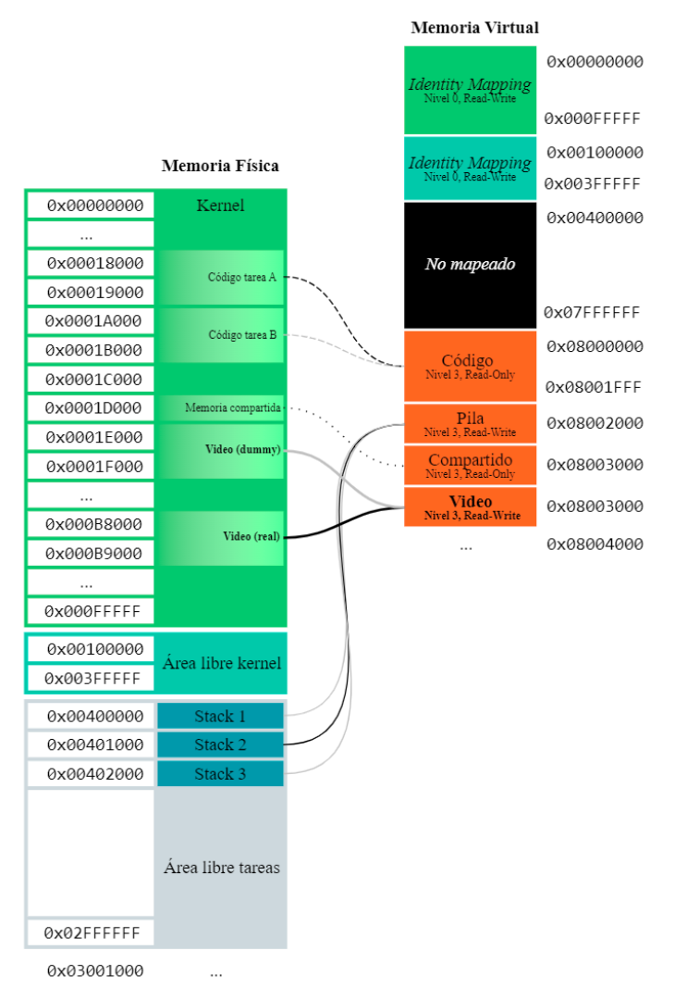
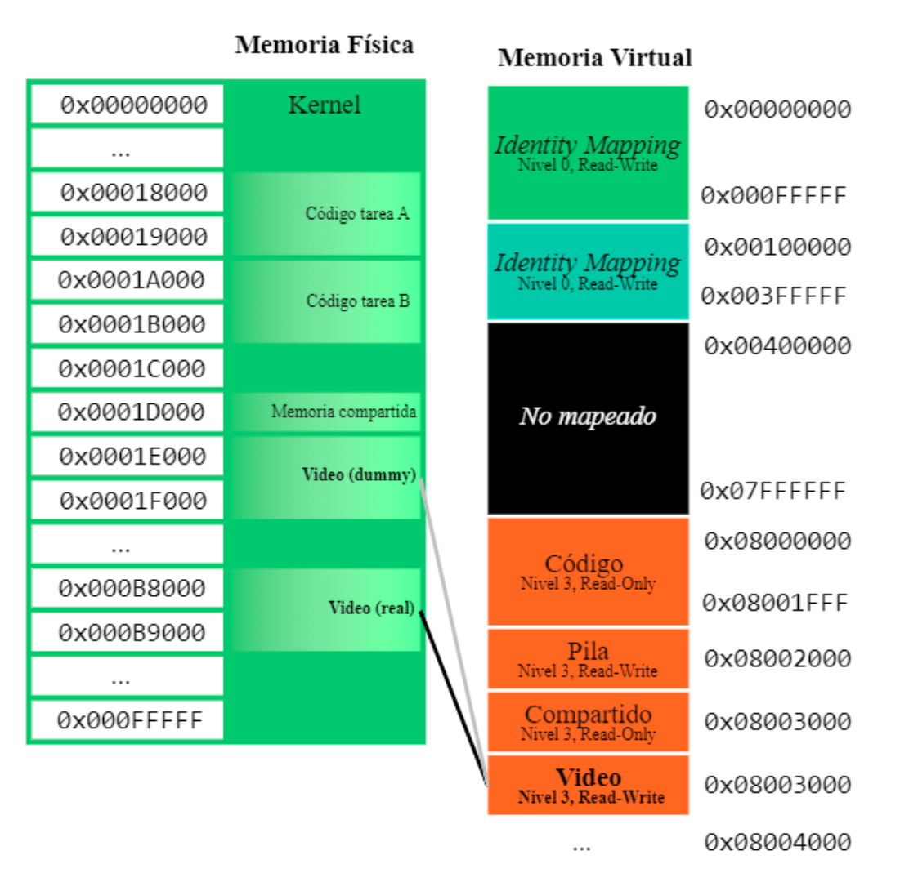
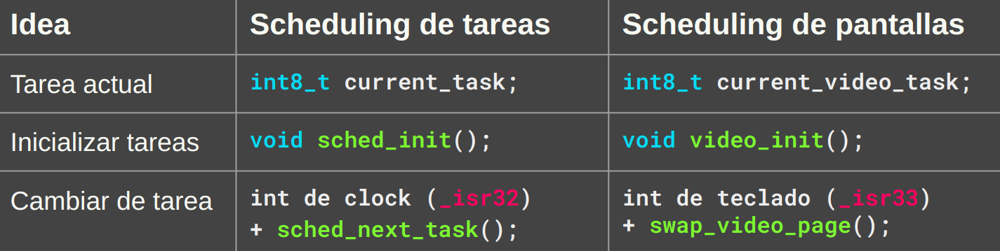

### Ejercicio 1 - (60 puntos)

En un sistema como el desarrollado en los talleres se desea modificar la forma en que las tareas se
muestran en la pantalla. 

En lugar de realizar la syscall `draw` (previamente implementada como int 88) se quiere que las tareas tengan acceso directo a la memoria de video:

* la memoria física de video (`0xB8000-0xB9FFF`) es la que se refleja en la pantalla real.

* Sólo puede haber una única tarea en un determinado momento con la memoria física de video (`0xB8000-0xB9FFF`) mapeada.

* El resto de las tareas tendrá asignadas una pantalla **dummy** (falsa) en la región física (`0x1E000-0x1FFFF`).

* La memoria de video de una tarea se mapeará **siempre** en el rango virtual `0x08004000-0x08005FFF`,
independientemente si tiene acceso a la pantalla real o no.

Con el diseño propuesto hay una única tarea “actualmente en pantalla” (con acceso a la memoria
física de video). 

Las tareas que no se encuentren en pantalla podrán escribir a las direcciones virtuales de video pero verán sus escrituras reflejadas en la “pantalla virtual compartida”(dummy).

Soltar la tecla TAB cambiará la tarea “actualmente en pantalla”. 

Los cambios de tarea en pantalla se realizarán de manera cíclica (T1-T2-T3-T4-T1-T2-...).

Se solicita describir los cambios requeridos para implementar esta nueva característica.

Para ello respondé los siguientes puntos:

### $a.$ Dibuje el esquema de memoria virtual de las tareas del nuevo sistema.

¿Cómo queda la memoria? 





$b.$ Describa los cambios al proceso de creación de tareas (`init_task_dir`, `create_task`, `sched_add_task`, etc...). 

Muestre código y pseudocódigo.

Agregar un mapping al esquema de memoria de las tareas

¿Dónde se define el esquema de memoria?

En `init_task_dir`. 

Alcanza con agregar un `mmu_map_page` ahí. 

¿Cuál es el valor inicial para `phy`?

Probemos con dummy :)


```c
paddr_t mmu_init_task_dir(paddr_t phy_start) {
  /* … */
  // Mappeo código, stack y shared
  mmu_map_page(cr3, TASK_CODE_VIRTUAL + PAGE_SIZE * 0, phy_start,
               MMU_P | MMU_U);
  mmu_map_page(cr3, TASK_CODE_VIRTUAL + PAGE_SIZE * 1, phy_start + PAGE_SIZE,
               MMU_P | MMU_U);
  mmu_map_page(cr3, TASK_CODE_VIRTUAL + PAGE_SIZE * 2, stack,
               MMU_P | MMU_U | MMU_W);
  mmu_map_page(cr3, TASK_CODE_VIRTUAL + PAGE_SIZE * 3, SHARED,
               MMU_P | MMU_U);
  // Mappeo video dummy (2 páginas)
  mmu_map_page(cr3, 0x08004000, 0x1E000, MMU_P | MMU_U | MMU_W);
  mmu_map_page(cr3, 0x08005000, 0x1F000, MMU_P | MMU_U | MMU_W);
}

```

$c.$ Explique qué mecanismo usará para que el sistema sepa “a qué tarea le toca” el acceso a la
pantalla.

Poder intercambiar la pantalla entre una tarea y la que le sigue:

Esto se parece peligrosamente al scheduler. ¿Podemos usar ideas de ahí?



No nos importa si la tarea está detenida o no.

No nos piden considerar el problema de agregar tareas.

$d.$ Describa los cambios necesarios para realizar el “cambio de pantalla” al soltar la tecla TAB.

Proponga una implementación posible mostrando código y pseudocódigo.

Poder intercambiar la pantalla entre una tarea y la que le sigue:

Cambiar de tarea son tres cosas:

* La tarea vieja pasa a ver la dummy en su esquema de paginación
* La tarea nueva pasa a ver la posta en su esquema de paginación
* Se actualiza `current_video_task`

```c
int8_t current_video_task; // Variable global

void swap_video_page() {
  int next_video_task = (current_video_task + 1) % MAX_TASKS;
  paddr_t cr3_current = tss_tasks[current_video_task].cr3;
  paddr_t cr3_next = tss_tasks[next_video_task].cr3;
  
  // La tarea actual pasa a la dummy
  mmu_map_page(cr3_current, 0x08004000, 0x1E000, MMU_P | MMU_U | MMU_W);
  mmu_map_page(cr3_current, 0x08005000, 0x1F000, MMU_P | MMU_U | MMU_W);
  
  // La siguiente tarea pasa a la posta
  mmu_map_page(cr3_next, 0x08004000, 0xB8000, MMU_P | MMU_U | MMU_W);
  mmu_map_page(cr3_next, 0x08005000, 0xB9000, MMU_P | MMU_U | MMU_W);
  
  // Y ahora la tarea nueva es la actual :)
  current_video_task = next_video_task;
}
```

Al arrancar el sistema: determinar quién tiene la primer pantalla

Alguien tiene que ser la primera en tener la pantalla. Dos opciones:

* Opción 1: `init_task_dir` toma un parámetro es_la_primera_tarea. Tenemos que modificar todo lo que use `init_task_dir`
* Opción 2: Todas las tareas arrancan con la dummy y en `kernel.asm` le damos la pantalla posta a alguna tarea después de crearla

```c
int8_t current_video_task; // Variable global
// NOTA: En algún lugar de kernel.asm vamos a tener que llamar a video_init!
paddr_t video_init() {
    int first_task = 0;
    paddr_t cr3 = tss_tasks[first_task].cr3;
    current_video_task = first_task;

    // Mappeo video posta (2 páginas)
    mmu_map_page(cr3, 0x08004000, 0xB8000, MMU_P | MMU_U | MMU_W);
    mmu_map_page(cr3, 0x08005000, 0xB9000, MMU_P | MMU_U | MMU_W);
}
```

Detectar que se apretó `TAB`

Es agregar un `if` en el código que procesa los eventos de teclado.

El enunciado dice que soltar `TAB` es el scancode `0x8F`

```asm
global _isr33
_isr33: ;rutina de atención del teclado
    pushad
    ; 1. Le decimos al PIC que vamos a atender la interrupción
    call pic_finish1
    
    ; 2. Leemos la tecla desde el teclado y la procesamos
    in al, 0x60
    push eax
    cmp al, 0x8F
    jne .no_es_soltar_tab
    call swap_video_page

    .no_es_soltar_tab:
        call tasks_input_process
        add esp, 4
        popad
        iret
```

$e.$ En el mecanismo propuesto las tareas no tienen forma sencilla de saber si “es su turno” de usar
la pantalla. 

Proponga una solución. 

No se pide código ni pseudocódigo, sólo la idea.

Agregar un mecanismo para que una tarea pueda responder: ¿Quién tiene la pantalla?
* Uno diría “Ya tenemos `current_video_task` ¿Qué más necesitamos?”
* Pero `current_video_task` es una variable global en el kernel
* Hay varias soluciones:
    * Agregar una syscall
    * Exponer `current_video_task` en la página compartida

$f.$ En el mecanismo propuesto la tarea debe redibujar toda su pantalla cuando logra conseguir
acceso a la misma. 

¿Cómo podría evitarse eso? 

No se pide código ni pseudocódigo, sólo la idea.

Agregar una forma de que las tareas no se choquen en la dummy
* El problema es que todas las tareas comparten la misma dummy
* Podría no ser así: Cada tarea tiene su propia dummy. Luego el cambio de
pantallas:

1. Guarda la pantalla actual
2. Restaura la pantalla de la próxima tarea

```c
void swap_video_page() {
    /* ... */
    // La tarea actual pasa a la dummy
    copy_page(dummy_video_page_de(current_video_task), 0xB8000);
    copy_page(dummy_video_page_de(current_video_task) + PAGE_SIZE, 0xB9000);
    mmu_map_page(cr3_current, 0x08004000, 0x1E000, MMU_P | MMU_U | MMU_W);
    mmu_map_page(cr3_current, 0x08005000, 0x1F000, MMU_P | MMU_U | MMU_W);
    // La siguiente tarea pasa a la posta
    copy_page(0xB8000, dummy_video_page_de(next_video_task));
    copy_page(0xB9000, dummy_video_page_de(next_video_task) + PAGE_SIZE);
    mmu_map_page(cr3_next, 0x08004000, 0xB8000, MMU_P | MMU_U | MMU_W);
    mmu_map_page(cr3_next, 0x08005000, 0xB9000, MMU_P | MMU_U | MMU_W);
    /* ... */
}
```

el scancode al apretar TAB es 0x0F. El scancode al soltarla es 0x8F.

---


### Ejercicio 2 - (40 puntos)

Sea un sistema similar al utilizado en los talleres de la materia que ejecuta concurrentemente $4$
tareas independientes. 

El mapa de memoria virtual es el mismo para todas la tareas y cada una tiene asignado `1MB` de memoria para datos. 

La tarea con el `ID 1` es una tarea maliciosa que puede “robarle” información a otras tareas utilizando el servicio `CopiarPagina` que recibe un `ID` de otra tarea en `EDI` y una dirección de memoria virtual en `ESI`. 

Este servicio se encarga de producir una copia de la página indicada por `ESI` de la tarea pasada por parámetro `EDI` en la misma página de la tarea llamadora.

Es decir, que si los parámetros pasados fueron `ID: 3` y posición de memoria virtual: `0x7000000`, al
finalizar el servicio la tarea llamadora tendrá en la página indicada por la posición de memoria virtual `0x7000000` una copia de lo que tenía la tarea `3` en esta dirección.

$a.$ Dibujar un esquema que muestre una posible distribución de memoria para este sistema.

$b.$ Implementar el servicio pedido. Definir para esto cualquier variable global utilizada. Indicar todo lo que se asume para resolver este ejercicio.

$c.$ Para que el servicio pedido funcione, ¿deben modificar la interrupción de reloj?. Si la respuesta
es sí, como deben modificarla?. Si la respuesta es no, explicar por qué.

